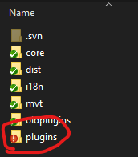
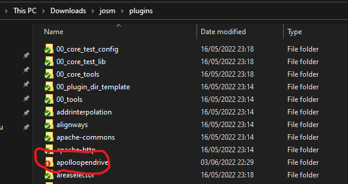
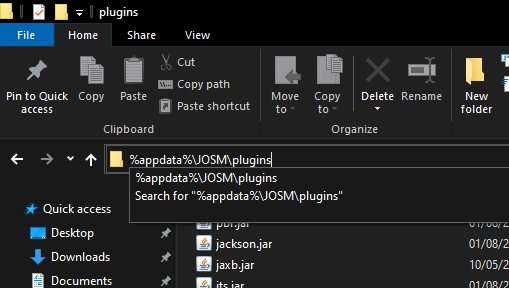
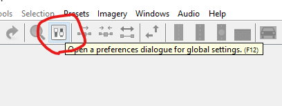
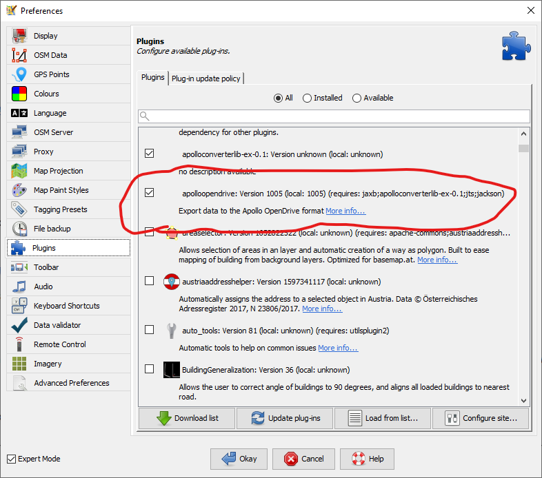

#JOSM Apollo OpenDRIVE Plugin
This is a plugin for the JOSM editor for displaying and importing Apollo OpenDRIVE data.
## Compiling the source code
This section can be skipped if you use a compiled binary from the release section.  
To compile the source code, the build script ("build.xml") contained within the repository can be used. The script requires the plugin environment from the [official repository](https://josm.openstreetmap.de/osmsvn/applications/editors/josm) and a compiled JOSM binary, which can either be downloaded from the [official website](https://josm.openstreetmap.de/) or compiled from the JOSM source code.  
  
  
  
The plugin source code then needs to be placed in the "plugins" folder of the environment.  
  
  
  
The commands to run the script are the same as seen in the [official development guide](https://josm.openstreetmap.de/wiki/DevelopersGuide/DevelopingPlugins):
  
`ant clean`  
`ant dist`
  
This will create several files in the "dist" folder of the environment root path, including the `apolloopendrive.jar` file, which contains the compiled plugin.
## Installing the plugin
The .jar file of the plugin must be placed in the plugin folder of JOSM. On Windows, this folder is located in the AppData folder of the current user. It can be accessed by opening the following path in the file explorer:    
  
`%appdata%\JOSM\plugins`  

  
After placing the plugin in the folder, JOSM is ready to be launched.  
When it finishes loading, open the settings by clicking on the icon in the top menu:  
  
  
  
In the screen that has now opened, select the "Plugins" tab and enable the "apolloopendrive" plugin in the list of plugins on the right.  
  
