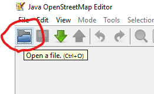
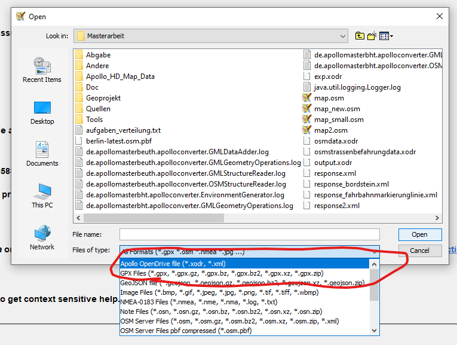
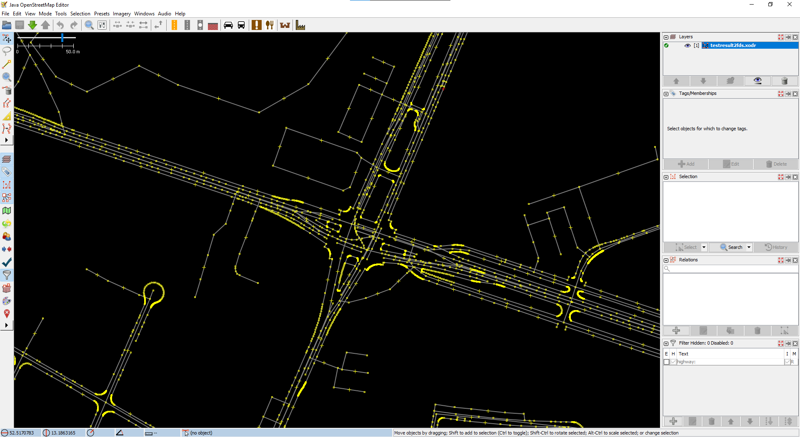

# JOSM Apollo OpenDRIVE Plugin
This is a plugin for the JOSM editor for displaying and importing Apollo OpenDRIVE data.
The conversion tool to create an Apollo OpenDRIVE file can be found [here](https://github.com/SebastianLoos/apolloopendriveconverter).
[Apollo Auto](https://developer.apollo.auto/index.html) is an open source autonomous driving software platform developed by Baidu.
## Compiling the source code
This section can be skipped if you use a compiled binary from the release section.  
To compile the source code, the build script ("build.xml") contained within the repository can be used. The script requires the plugin environment from the [official repository](https://josm.openstreetmap.de/osmsvn/applications/editors/josm) and a compiled JOSM binary, which can either be downloaded from the [official website](https://josm.openstreetmap.de/) or compiled from the JOSM source code.  
  
  
  
The plugin source code then needs to be placed in the "plugins" folder of the environment.  
  
  
  
The commands to run the script are the same as seen in the [official development guide](https://josm.openstreetmap.de/wiki/DevelopersGuide/DevelopingPlugins):
  
`ant clean`  
`ant dist`
  
This will create several files in the "dist" folder of the environment root path, including the `apolloopendrive.jar` file, which contains the compiled plugin.
## Installing the plugin
The .jar file of the plugin must be placed in the plugin folder of JOSM. On Windows, this folder is located in the AppData folder of the current user. It can be accessed by opening the following path in the file explorer:    
  
`%appdata%\JOSM\plugins`  

  
After placing the plugin in the folder, JOSM is ready to be launched.  
It is important to launch JOSM with the Java version 8. On Java version 9 or newer, the plugin will crash upon loading a file.  
If your system has a different default Java version than version 8, launch the .jar file of JOSM via the command line to manually select the correct Java binary. The JOSM binary is located in the following folder:

`%appdata%\..\Local\JOSM\app`

Below is an example command to launch JOSM with a Java binary of version 1.8.0.211:  
  
`'C:\Program Files\Java\jdk1.8.0_211\bin\java.exe' -jar .\josm-custom.jar`  

When it finishes loading, open the settings by clicking on the icon in the top menu:  
  
  
  
In the screen that has now opened, select the "Plugins" tab and enable the "apolloopendrive" plugin in the list of plugins on the right.  
  

## Using the plugin
When the plugin is enabled click on the "Open file" icon in the top left.  
  
  

### Import Apollo OpenDRIVE data
You can now select "Apollo OpenDRIVE file" in the file type dropdown menu and open any Apollo OpenDRIVE file. Larger files may take a few minutes to import. A demo file containing a small area of road data can be found in the [demo](demo/demo.xodr) folder of the repository.  

After loading the file, the geometries contained in the Apollo OpenDRIVE file should be visible.

  

### Export Apollo OpenDRIVE data
This feature is no yet completed.

A planned feature currently under development is the the export of loaded OSM (and other) data into the Apollo OpenDRIVE format using the [Apollo OpenDRIVE conversion tool](https://github.com/SebastianLoos/apolloopendriveconverter).